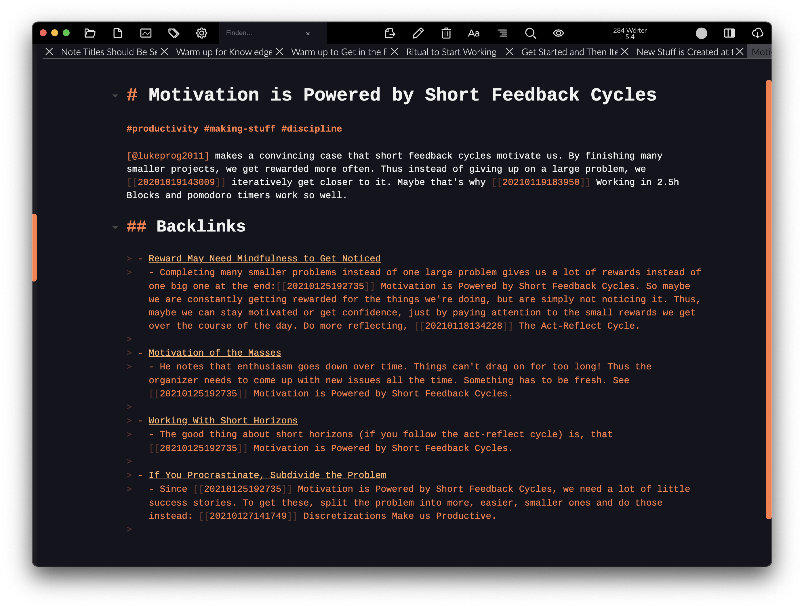

# zettelcon

***

## Work in Progress

***

> An external CLI tool for Zettlr note collections to **automatically add backlinks** to your note files.
> Edits files in-place, so be careful and try on a copy of your files first. Run whenever you feel like an update would be worth it.
> 
> Also check out [zettelwarmer](https://github.com/whateverforever/zettelwarmer) for finding new interconnections between your notes.



## Assumptions

- Zettlr-standard wiki-links are used (`[[...]]`)
- Single-line markdown syntax for headings is used (`# some heading`)
- Note IDs are unique, also relative to the names of the notes
- The backlink section is the last thing of a page
- Two spaces are used for list indentation

## Features

- Single python file, no dependencies, under 200 sloc
- Can run multi-core for large collections
- Supports any note ID syntax without explicit regex
- Supports collections that contain more than one note ID style

```
$ python3 zettelcon.py --help
usage: zettelcon.py [-h] -f FOLDER [-s SUFFIX] [-c] [-n NPROCS] [-ic]

Tool to insert automatic backlinks into Zettlr note collections or other
interlinked markdown files.

optional arguments:
  -h, --help            show this help message and exit
  -f FOLDER, --folder FOLDER
                        Path to folder with all the zettels in it.
  -s SUFFIX, --suffix SUFFIX
                        Suffix for the files to consider. Defaults to .md
  -c, --clear-backlinks
                        Instead of generating backlinks, revert all files to a
                        no-backlinks state
  -n NPROCS, --nprocs NPROCS
                        Number of worker processes to run for file reading and
                        writing.
  -ic, --ignore-cache   Don't use zettelcon's cache, force writing to _all_
                        Zettel files (even the ones where backlinks haven't
                        changed).
```

---

---

## Future Work

- [ ] Only cite a few words before and after the citation
- [ ] Add horizontal break before backlinks
- [ ] Output additional info such as islands, sinks, sources, etc.
- [ ] Check out what happens if a file that links to another doesn't have a title
- [x] Somehow reduce the number of files that are written
  - Zettlr takes quite a while to update its indices after the files get changed
    so it would be benefitial to reduce write operations only to files that actually
    get new backlinks
- [x] Add option to clear all backlinks
- [x] Make file writing multi core
- [x] Add "last edited XXX" info field to markdown
- [x] Do an analysis of computation complexity as a function of number of files (or links)
  - As expected, it's linear in the number of files
  - Doubling the cores increases performance by ~1.5x
  - Ca. 1500 notes per second dual core, 2300 n/s quad core
## Discarded Ideas

- [ ] ~~Add option to commit everything to git before updating links~~
  - Not needed, because you can simply define a shell function to do that
  - ```bash
    gen-backlinks() {
      cd $ZETTELPATH && git add -A && git commit -m "pre-zettelcon backup" ;\
      python ~/...path.../zettelcon.py -f $ZETTELPATH
    }
    ```

---
## Issues

- [x] Friction is not updated for some reason
  - (maybe because nothing points to it?)
  - Bug is if a formerly connected note is isolated, its backlinks stay and never change
- If something is quoted in a list, the list is copied over to the backlink section messing up the alignment and formatting
  - Maybe this can be fixed by not going by paragraphs but newlines instead
  - [x] Clean quotes lines from any markdown symbols before the line begins
- [x] Display first H1 tag in backlink list, if available
  - Needed if the file names are only IDs and don't give any information of the title
- [x] Last letter of Agency, Kanban, Habits is cut off
  - These are all files with no contents besides the heading
- [x] Path in backlinks needs to be relative to markdown file
- [x] Bureaucracy is fucked up
- [x] Not idempotent